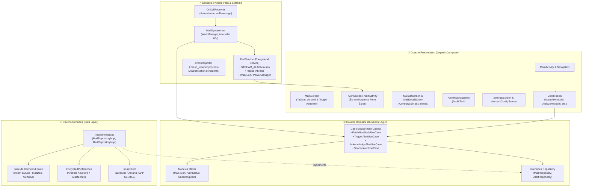
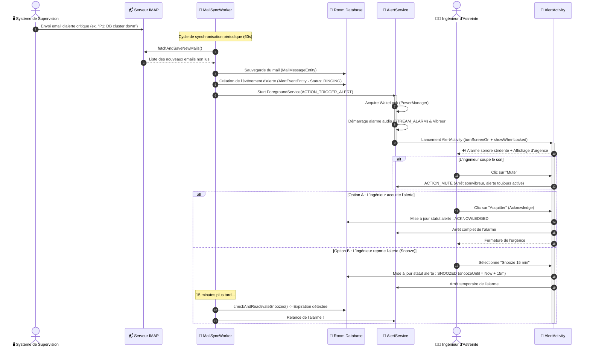

# 🚨 Asteintus (ex-OnCallMail)

> **Application mobile Android native d'astreinte technique (On-Call) et client d'alerte IMAP haute priorité pour équipes d'ingénierie, SRE, DevOps et administrateurs d'infrastructures critiques.**

---

## 📋 Table des matières

1. [À quoi sert l'application ?](#-à-quoi-sert-lapplication-)
2. [Fonctionnalités clés](#-fonctionnalités-clés)
3. [Comment l'utiliser (Guide de prise en main)](#-comment-lutiliser-guide-de-prise-en-main)
   - [1. Configuration du compte de messagerie (IMAP)](#1-configuration-du-compte-de-messagerie-imap)
   - [2. Autorisations système requises](#2-autorisations-système-requises)
   - [3. Activation du mode astreinte](#3-activation-du-mode-astreinte)
   - [4. Réception et traitement d'une alerte critique](#4-réception-et-traitement-dune-alerte-critique)
4. [Schémas d'Architecture & Conception Technique](#-schémas-darchitecture--conception-technique)
   - [1. Schéma d'Architecture Globale (ASCII)](#1-schéma-darchitecture-globale-ascii)
   - [2. Diagramme Logique (Clean Architecture + MVVM)](#2-diagramme-logique-clean-architecture--mvvm)
   - [3. Moteur de Sonnerie & DND Bypass (ASCII)](#3-moteur-de-sonnerie--dnd-bypass-ascii)
   - [4. Diagramme de Composants Android](#4-diagramme-de-composants-android)
   - [5. Cycle de Vie d'un Incident & Machine à États (ASCII)](#5-cycle-de-vie-dun-incident--machine-à-états-ascii)
   - [6. Diagramme de Séquence Chronologique](#6-diagramme-de-séquence-chronologique)
5. [Sécurité et Confidentialité (RGPD)](#-sécurité-et-confidentialité-rgpd)
   - [Pipeline de Sécurité Matérielle & Rétention (ASCII)](#pipeline-de-sécurité-matérielle--rétention-ascii)
6. [Structure Détaillée du Projet](#-structure-détaillée-du-projet)
7. [Stack Technologique](#-stack-technologique)
8. [Compilation & Déploiement](#-compilation--déploiement)

---

## 🎯 À quoi sert l'application ?

Dans un environnement de production 24/7, les systèmes de supervision (Prometheus, Alertmanager, Datadog, Grafana, AWS CloudWatch, Zabbix, etc.) envoient fréquemment des notifications par email lors d'incidents critiques (P1/P2, pannes d'infrastructure, indisponibilité de bases de données, ruptures de SLA).

Cependant, les clients de messagerie traditionnels présentent des failles rédhibitoires pour les ingénieurs d'astreinte :
* **Alertes inaudibles la nuit** : le mode « Ne pas déranger » (DND) ou le mode silencieux étouffe les notifications d'emails ordinaires.
* **Notifications noyées** : les alertes d'urgence sont mélangées aux newsletters ou aux notifications secondaires.
* **Absence d'acquittement formel** : rien n'oblige l'ingénieur à accuser réception ou à reporter l'alerte pour éviter qu'elle ne soit oubliée pendant son sommeil.

**Asteintus** transforme votre smartphone en un véritable récepteur d'astreinte résilient :
1. **Surveillance continue** : Interroge la boîte email d'alerte via le protocole IMAP sécurisé (SSL/TLS).
2. **Alarme d'urgence prioritaire** : Dès qu'un incident est détecté, l'application déclenche une sonnerie stridente via le flux audio d'alarme système (`STREAM_ALARM`), capable d'outrepasser le mode « Ne pas déranger » (DND) et le mode silencieux.
3. **Réveil de l'appareil & Plein Écran** : Allume automatiquement l'écran et affiche une interface d'urgence par-dessus l'écran verrouillé (`turnScreenOn`, `showWhenLocked`).
4. **Acquittement & Snooze intelligent** : L'ingénieur peut couper la sonnerie pour analyser la situation à tête reposée (`Mute`), reporter l'alerte (`Snooze` à 5, 15 ou 30 minutes) ou l'acquitter définitivement (`Acknowledge`).
5. **Accès sans friction** : Démarrage direct et ergonomique dès que l'appareil est déverrouillé (sans barrière biométrique redondante à l'ouverture, à l'instar d'applications comme Outlook).

---

## ✨ Fonctionnalités clés

| Fonctionnalité | Description |
| :--- | :--- |
| **Bascule d'Astreinte (1-Tap On-Call)** | Activez ou désactivez la surveillance en un geste grâce à l'interrupteur central. Hors astreinte, aucun processus d'arrière-plan ne tourne. |
| **Alarme DND Bypass** | Flux audio système dédié `STREAM_ALARM` avec sonnerie en boucle et motifs de vibrations haptiques d'urgence. |
| **Écran d'Urgence Plein Écran** | `AlertActivity` s'affiche immédiatement au premier plan, réveille l'appareil et passe outre le lockscreen. |
| **Acquittement & Snooze Réactif** | Bouton « Mute » (coupe le son pour lire au calme), « Acknowledge » (ferme l'incident), ou « Snooze » (relance l'alarme si l'incident persiste après 5, 15 ou 30 min). |
| **File d'Attente d'Alertes** | Gestion intelligente des tempêtes d'alertes : si plusieurs incidents surviennent simultanément, ils sont empilés et présentés séquentiellement. |
| **Client IMAP Sécurisé** | Prise en charge universelle des serveurs IMAP (Gmail, Outlook/Office365, serveurs d'entreprise) avec SSL/TLS (port 993) ou STARTTLS. |
| **Synchronisation WorkManager** | Synchronisation robuste en arrière-plan avec réarmement automatique toutes les 60 secondes pendant l'astreinte. |
| **Reprise automatique au démarrage** | `OnCallReceiver` réactive la surveillance en cas de redémarrage inopiné du téléphone (`BOOT_COMPLETED`). |
| **Stockage Chiffré & Keystore** | Mots de passe et identifiants chiffrés via `EncryptedSharedPreferences` appuyé sur le matériel sécurisé (Android Keystore). |
| **Rétention RGPD (Storage Limitation)** | Purge automatique des courriels et des journaux d'audit de plus de 30 jours (Art. 5(1)(e) RGPD). |
| **Historique & Traçabilité** | Journalisation complète de chaque alerte (horodatage de réception, date d'acquittement, statut, motif). |
| **Crash Reporter Résilient** | Processus isolé (`:crash_reporter`) capturant les anomalies non gérées avec écran de diagnostic dédié. |

---

## 🚀 Comment l'utiliser (Guide de prise en main)

### 1. Configuration du compte de messagerie (IMAP)
1. Lancez **Asteintus**.
2. Rendez-vous dans **Paramètres** ⚙️ puis **Configuration du compte**.
3. Renseignez les paramètres de connexion :
   - **Adresse email** : l'adresse surveillée (ex. `oncall@votre-domaine.com`).
   - **Hôte IMAP** : serveur de messagerie (ex. `imap.gmail.com`, `outlook.office365.com` ou votre serveur privé).
   - **Port IMAP** : par défaut `993` pour SSL/TLS (ou `143` pour STARTTLS).
   - **Nom d'utilisateur & Mot de passe** : vos identifiants (ou mot de passe d'application pour Gmail / Microsoft 365).
   - **Type de sécurité** : `SSL/TLS` (fortement recommandé).
4. Cliquez sur **Enregistrer & Tester la connexion**.

### 2. Autorisations système requises
Pour garantir qu'aucune alerte ne soit manquée :
* **Notifications** : autorisez les notifications système (`POST_NOTIFICATIONS`).
* **Optimisation de la batterie** : acceptez l'exemption d'optimisation de batterie (Doze Mode). Cela empêche Android de suspendre le worker d'Asteintus lorsque le smartphone est en veille prolongée.
* **Affichage plein écran** : autorisez l'affichage par-dessus l'écran de verrouillage (`USE_FULL_SCREEN_INTENT`).

### 3. Activation du mode astreinte
* Sur l'écran principal, basculez l'interrupteur **« Activer l'astreinte »**.
* Une notification d'état persistante apparaît dans votre barre de notifications, confirmant qu'Asteintus veille activement.
* Dès cet instant, la boîte de réception est synchronisée toutes les 60 secondes. Vous pouvez également déclencher une synchronisation manuelle via le bouton d'actualisation 🔄.

### 4. Réception et traitement d'une alerte critique
Lorsqu'un incident survient :
1. **L'alarme retentit** immédiatement au volume maximal et le téléphone vibre en boucle.
2. L'écran de l'appareil s'allume automatiquement et affiche l'incident.
3. Trois actions principales s'offrent à vous :
   - 🔇 **Couper la sonnerie (Mute)** : interrompt la sonnerie et les vibrations pour analyser l'incident en silence sans le clore.
   - ✉️ **Consulter le message** : ouvre le détail complet de l'email pour lire les logs, traces d'erreur et liens de remédiation.
   - ⏰ **Reporter (Snooze)** : choisissez 5 min, 15 min ou 30 min. L'alerte se réveillera si le problème n'est pas résolu.
   - ✅ **Acquitter (Acknowledge)** : confirme votre prise en charge et clôture l'alerte pour ce message.

---

## 🏛 Schémas d'Architecture & Conception Technique

### 1. Schéma d'Architecture Globale (ASCII)

```text
+-----------------------------------------------------------------------------------+
|                        📱 COUCHE PRÉSENTATION (Jetpack Compose)                   |
|                                                                                   |
|  [MainScreen]             [AlertScreen / AlertActivity]     [MailList & Detail]  |
|  • Toggle Astreinte ON/OFF• Écran d'Urgence Plein Écran     • Lecture des alertes |
|  • Diagnostic Doze / Batt • Mute / Snooze / Acknowledge     • Filtres & Statuts   |
|         │                                 │                          │            |
|         ▼                                 ▼                          ▼            |
|  [MainViewModel]                  [AlertViewModel]          [MailListViewModel]   |
+─────────────────────────────────────────┼─────────────────────────────────────────+
                                          │ UI State (StateFlow) / Actions
                                          ▼
+-----------------------------------------------------------------------------------+
|                          ⚙️ COUCHE DOMAINE (Domain Layer)                          |
|                                                                                   |
|       [FetchNewMailsUseCase]                 [TriggerAlertUseCase]                |
|       [AcknowledgeAlertUseCase]              [SnoozeAlertUseCase]                 |
|                                                                                   |
|       Entités Métier : Mail, Alert (RINGING, SNOOZED, ACKNOWLEDGED), SnoozeOption |
|       Contrats / Interfaces : MailRepository, AlertRepository                     |
+─────────────────────────────────────────┼─────────────────────────────────────────+
                                          │ Appels métiers purs
                                          ▼
+-----------------------------------------------------------------------------------+
|                           💾 COUCHE DONNÉES (Data Layer)                          |
|                                                                                   |
|   [MailRepositoryImpl]                       [AlertRepositoryImpl]                |
|          │                                              │                         |
|   ┌──────┴──────────────────────┬───────────────────────┴──────┐                  |
|   │                             │                              │                  |
|   ▼                             ▼                              ▼                  |
| [ImapClient]           [EncryptedPreferences]           [AppDatabase (Room)]      |
| • Jakarta Mail         • Android Keystore               • MailDao (Messages)      |
| • IMAP over SSL/TLS    • MasterKey AES-256 GCM          • AlertDao (Événements)   |
+───┼────────────────────────────────────────────────────────────┼──────────────────+
    │ Réseau SSL                                                 │ Persistance locale
    ▼                                                            ▼
+──────────────────────────+                     +──────────────────────────────────+
|  🌐 SERVEUR IMAP DISTANT |                     | 🗄️ STOCKAGE LOCAL SÉCURISÉ       |
|  (Gmail, Exchange, O365, |                     | • SQLite Chiffré / Room DB       |
|   Postfix, Dovecot)      |                     | • Purge auto RGPD (30 jours)     |
+──────────────────────────+                     +──────────────────────────────────+
```

---

### 2. Diagramme Logique (Clean Architecture + MVVM)



---

### 3. Moteur de Sonnerie & DND Bypass (ASCII)

```text
                   RÉCEPTION D'UN EMAIL CRITIQUE EN PLEINE NUIT
                                        │
                                        ▼
             +──────────────────────────────────────────────────────+
             |         WorkManager : MailSyncWorker (60s)           |
             |       Détecte un nouvel incident non acquitté        |
             +──────────────────────────┬───────────────────────────+
                                        │
                                        ▼
             +──────────────────────────────────────────────────────+
             |           AlertService (Foreground Service)          |
             |                                                      |
             |  1. PowerManager.WakeLock ────────> Réveille le CPU  |
             |  2. AudioAttributes.USAGE_ALARM ──> Force le volume |
             |  3. AudioManager.STREAM_ALARM ────> BYPASS DND / SIL |
             |  4. Vibrator (Waveform Haptic) ───> Vibre en boucle  |
             |  5. USE_FULL_SCREEN_INTENT ───────> Force l'affichage|
             +──────────────────────────┬───────────────────────────+
                                        │
                                        ▼
+───────────────────────────────────────────────────────────────────────────────────+
|               📱 AlertActivity (Au-dessus du Lockscreen Android)                   |
|                                                                                   |
|   [turnScreenOn = true]                   [showWhenLocked = true]                 |
|                                                                                   |
|   ┌───────────────────────────────────────────────────────────────────────────┐   |
|   │ 🚨 ALERTE D'ASTREINTE P1 - BASE DE DONNÉES DOWN                          │   |
|   │ De : monitoring@prod.infra.net   •   Reçu à : 03:14:22                    │   |
|   │                                                                           │   |
|   │ [ 🔇 Couper le son ]   [ ⏰ Snooze (5/15/30m) ]   [ ✅ Acquitter ]        │   |
|   └───────────────────────────────────────────────────────────────────────────┘   |
+───────────────────────────────────────────────────────────────────────────────────+
```

---

### 4. Diagramme de Composants Android

```mermaid
flowchart LR
    IMAP[("🌐 Serveur IMAP\n(Exchange, Gmail, Dovecot)")]
    
    subgraph Android_OS ["Plateforme Android"]
        WM["WorkManager"]
        Audio["AudioManager\n(STREAM_ALARM)"]
        Power["PowerManager\n(WakeLock)"]
        Notif["NotificationManager\n(High Priority Channel)"]
        KeyStore["Android Keystore"]
    end

    subgraph Asteintus_Core ["Moteur Asteintus"]
        Worker["MailSyncWorker"]
        Client["ImapClient"]
        Service["AlertService"]
        Activity["AlertActivity"]
        DB[("Room Database\n(Cache & Historique)")]
    end

    WM -->|Déclenche toutes les 60s| Worker
    Worker -->|Requête IMAP FETCH| Client
    Client <-->|SSL / TLS| IMAP
    Worker -->|Sauvegarde nouveaux messages| DB
    Worker -->|Si nouvel incident| Service
    Service -->|Wake device| Power
    Service -->|Sonne à plein volume (DND bypass)| Audio
    Service -->|Affiche bannière prioritaire| Notif
    Service -->|Lance plein écran| Activity
    EncryptedPrefs["EncryptedPreferences"] <-->|Chiffrement matériel| KeyStore
```

---

### 5. Cycle de Vie d'un Incident & Machine à États (ASCII)

```text
           [ Email d'Incident Détecté ]
                        │
                        ▼
              ┌───────────────────┐
              │    Statut: NEW    │
              └─────────┬─────────┘
                        │ Enregistrement DB & Trigger Alerte
                        ▼
              ┌───────────────────┐        🔇 MUTE (Audio coupé)
              │  Statut: RINGING  │ ─────────────────────────────────┐
              │  (Alarme + Vibre) │ ◄──────────────────────────────┐ │
              └─────────┬─────────┘                                │ │
                        │                                          │ │
               ┌────────┴──────────────┐                           │ │
               │                       │                           │ │
               ▼                       ▼                           │ │
      ┌──────────────────┐    ┌──────────────────┐                 │ │
      │ Statut: SNOOZED  │    │Statut:ACKNOWLEDGE│                 │ │
      │ (5, 15 ou 30 min)│    │ (Incident clos)  │                 │ │
      └────────┬─────────┘    └──────────────────┘                 │ │
               │                                                   │ │
               │ Délai expiré                                      │ │
               └───────────────────────────────────────────────────┘ │
                                                                     │
               (L'ingénieur analyse le problème en silence) ─────────┘
```

---

### 6. Diagramme de Séquence Chronologique



---

## 🛡 Sécurité et Confidentialité (RGPD)

### Pipeline de Sécurité Matérielle & Rétention (ASCII)

```text
+-----------------------------------------------------------------------------------+
|                     🛡️ SÉCURITÉ MATÉRIELLE & CYCLE DE VIE RGPD                     |
+-----------------------------------------------------------------------------------+
|                                                                                   |
|  1. IDENTIFIANTS & MOTS DE PASSE IMAP                                             |
|     Clé Maître HW (Android Keystore) ──> AES-256 GCM ──> EncryptedSharedPreferences|
|     (Aucun mot de passe stocké en clair sur le disque ou dans les logs)           |
|                                                                                   |
|  2. COMMUNICATIONS EN TRANSIT                                                     |
|     Applet ──────────── SSL/TLS (Port 993) / STARTTLS ────────────> Serveur Mail  |
|     (Cleartext Traffic strictement interdit via network_security_config.xml)      |
|                                                                                   |
|  3. CYCLE DE RÉTENTION DES DONNÉES (RGPD Art. 5(1)(e))                            |
|     Chaque exécution de MailSyncWorker :                                          |
|     Timestamp Actuel - (30 jours * 86400s) = Seuil de péremption                  |
|               │                                                                   |
|               ▼                                                                   |
|     DELETE FROM mails WHERE receivedTime < :seuil                                 |
|     DELETE FROM alert_events WHERE triggeredTime < :seuil                         |
|                                                                                   |
+-----------------------------------------------------------------------------------+
```

* **Stockage sécurisé des identifiants** : Les informations d'authentification du serveur IMAP (notamment les mots de passe) ne sont jamais enregistrées en texte clair. Elles sont chiffrées à l'aide de l'API **AndroidX Security Crypto** (`EncryptedSharedPreferences`), qui s'appuie sur une clé principale générée dans l'**Android Keystore** matériel.
* **Chiffrement en transit** : Toutes les communications avec votre serveur de messagerie s'effectuent via des tunnels chiffrés **SSL/TLS** ou **STARTTLS**. Le trafic en clair est strictement interdit (`usesCleartextTraffic="false"`).
* **Conformité RGPD (Art. 5(1)(e) - Limitation de conservation)** :
  * Les métadonnées d'emails, corps de messages et journaux d'alertes sont automatiquement purgés de la base de données locale après **30 jours**.
* **Respect de la vie privée** : Aucune donnée de messagerie n'est transmise à des tiers ni à des serveurs d'analytique externes. Toutes les opérations de filtrage et d'alerte s'effectuent localement sur l'appareil.

---

## 📁 Structure Détaillée du Projet

```text
app/src/main/java/com/example/
├── AsteintusApp.kt                # Application principale & configuration des Notification Channels
├── AppContainer.kt                # Conteneur d'injection de dépendances (Service Locator / Lazy singletons)
├── AppConstants.kt                # Constantes système (durée de rétention RGPD, expiration certificat)
├── MainActivity.kt                # Activité hôte principale Jetpack Compose
│
├── data/
│   ├── local/
│   │   ├── db/                    # Base de données Room (AppDatabase, MailDao, AlertDao)
│   │   └── entity/                # Entités de persistance (MailMessageEntity, AlertEventEntity)
│   ├── prefs/                     # Préférences sécurisées (EncryptedPreferences, AccountConfig)
│   ├── remote/imap/               # Client IMAP réseau (ImapClient, RemoteMailMessage via JavaMail)
│   └── repository/                # Implémentations concrètes des dépôts (MailRepositoryImpl, AlertRepositoryImpl)
│
├── domain/
│   ├── model/                     # Modèles métier purs (Mail, Alert, SnoozeOption, MailStatus)
│   ├── repository/                # Contrats d'interfaces des dépôts
│   └── usecase/                   # Cas d'utilisation métier (Fetch, Trigger, Acknowledge, Snooze)
│
├── presentation/
│   ├── alert/                     # Écran et activité d'urgence (AlertActivity, AlertScreen, AlertViewModel)
│   ├── main/                      # Tableau de bord principal (MainScreen, MainViewModel)
│   ├── maillist/                  # Liste des emails reçus (MailListScreen, MailListViewModel)
│   ├── maildetail/                # Consultation du contenu d'un email (MailDetailScreen, MailDetailViewModel)
│   ├── history/                   # Journal d'audit des alertes (AlertHistoryScreen, AlertHistoryViewModel)
│   ├── settings/                  # Paramètres et configuration IMAP (SettingsScreen, AccountConfigScreen)
│   ├── crash/                     # Écran de diagnostic autonome (CrashReportActivity)
│   └── navigation/                # Définition des routes de navigation Jetpack Compose
│
├── service/
│   ├── AlertService.kt            # Service d'arrière-plan de lecture d'alarme et gestion de la file d'attente
│   └── OnCallReceiver.kt          # BroadcastReceiver réactivant la surveillance au démarrage de l'OS
│
├── util/
│   └── CrashReporter.kt           # Gestionnaire d'exceptions non interceptées (Thread.UncaughtExceptionHandler)
│
└── worker/
    └── MailSyncWorker.kt          # Travailleur WorkManager exécutant la synchronisation périodique
```

---

## 🛠 Stack Technologique

* **Langage** : Kotlin (100%) avec Coroutines & Asynchronous Flow.
* **Interface Utilisateur** : Jetpack Compose avec Material Design 3 (M3).
* **Architecture** : Clean Architecture & MVVM (Unidirectional Data Flow).
* **Base de Données Locale** : Room Database (SQLite).
* **Sécurité & Chiffrement** : AndroidX Security Crypto (MasterKey, EncryptedSharedPreferences).
* **Protocoles Réseau & Mail** : Android Mail / Jakarta Mail API (IMAP over SSL/TLS).
* **Tâches d'Arrière-Plan** : AndroidX WorkManager & Foreground Services (`mediaPlayback` type).
* **Gestion d'Énergie** : PowerManager WakeLock ciblé pendant la sonnerie d'alerte.
* **Tests & Qualité** : Robolectric, JUnit, MockK.

---

## 💻 Compilation & Déploiement

### Prérequis
* **Android Studio** Ladybug (ou version plus récente).
* **JDK** 17 ou supérieur.
* **Android SDK** API 36 (Minimum SDK API 26 - Android 8.0 Oreo).

### Compilation locale via Gradle

1. Clonez le dépôt sur votre poste :
   ```bash
   git clone https://github.com/votre-organisation/asteintus.git
   cd asteintus
   ```

2. Créez un fichier `.env` à la racine si nécessaire (en vous basant sur `.env.example`).

3. Compilez la version Debug :
   ```bash
   ./gradlew assembleDebug
   ```

4. L'APK généré se trouvera dans :
   ```text
   app/build/outputs/apk/debug/app-debug.apk
   ```

5. Installez directement sur un terminal Android connecté en débogage USB :
   ```bash
   adb install -r app/build/outputs/apk/debug/app-debug.apk
   ```

---

## 📄 Licence

Ce projet est sous licence open-source. Consultez le fichier `LICENSE` pour de plus amples informations.
