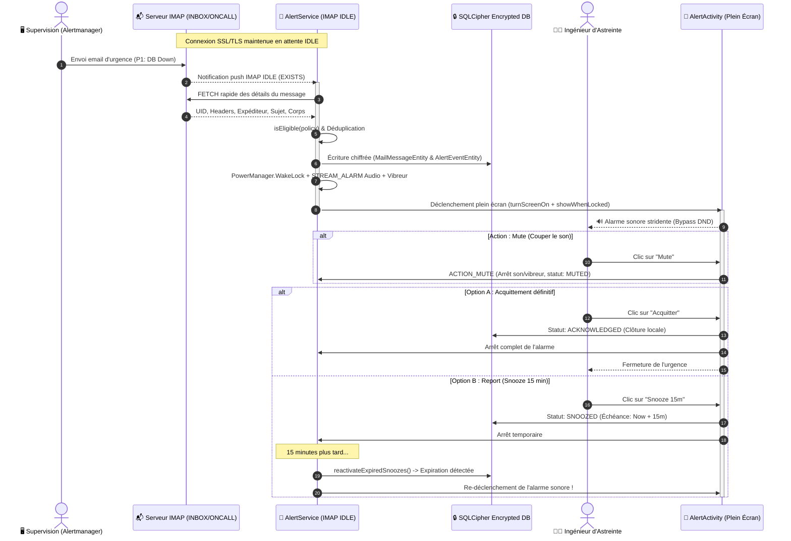

# 🚨 Asteintus — Version 0.9.0.0

> **Récepteur d'astreinte Android haute fiabilité (< 3 min SLA) pour flottes gérées par MDM, sans webhook ni push propriétaire, basé sur une boîte IMAP strictement contrôlée.**

[](https://github.com/)
[](https://github.com/)
[-orange.svg)](https://github.com/)
[-green.svg)](https://github.com/)
[](https://github.com/)

---

## 📋 Table des matières

1. [Objectif cible & Contrat de Service (SLA)](#-objectif-cible--contrat-de-service-sla)
2. [Changement d'Architecture Structurant (v0.9.0.0)](#-changement-darchitecture-structurant-v0900)
3. [Schémas d'Architecture & Conception Technique](#-schémas-darchitecture--conception-technique)
   - [1. Architecture Cible & Flux de Données (ASCII)](#1-architecture-cible--flux-de-données-ascii)
   - [2. Moteur IMAP IDLE, DND Bypass & Réveil (ASCII)](#2-moteur-imap-idle-dnd-bypass--réveil-ascii)
   - [3. Machine à États de Santé (Health State Machine)](#3-machine-à-états-de-santé-health-state-machine)
   - [4. Cycle de Vie d'un Incident & Traçabilité (ASCII)](#4-cycle-de-vie-dun-incident--traçabilité-ascii)
   - [5. Diagramme de Séquence Chronologique (Mermaid)](#5-diagramme-de-séquence-chronologique-mermaid)
4. [Lots de Réalisation (Chantiers v0.9.0.0)](#-lots-de-réalisation-chantiers-v0900)
   - [Lot 1 : Sécurisation des Données & Surface d'Attaque (SQLCipher, Sanitization)](#lot-1--sécurisation-des-données--surface-dattaque)
   - [Lot 2 : Politique d'Éligibilité (`AlertPolicy`) & Déduplication](#lot-2--politique-déligibilité-alertpolicy--déduplication)
   - [Lot 3 : Fiabilité SLA 3 Min & Télémétrie de Santé](#lot-3--fiabilité-sla-3-min--télémétrie-de-santé)
   - [Lot 4 : Gestion d'Alerte Persistante (DB Single Source of Truth)](#lot-4--gestion-dalerte-persistante)
   - [Lot 5 : Intégration MDM (Android Enterprise Restrictions)](#lot-5--intégration-mdm)
5. [Guide d'Utilisation & Déploiement](#-guide-dutilisation--déploiement)
6. [Structure du Projet](#-structure-du-projet)
7. [Compilation & Installation](#-compilation--installation)

---

## 🎯 Objectif cible & Contrat de Service (SLA)

### Contrat de service
1. **Délai maximal garanti** : Lorsqu'un e-mail admissible est déposé dans le dossier IMAP d'astreinte dédié (ex. `INBOX/ONCALL`), l'application déclenche une alarme sonore locale à plein volume sur un terminal conforme en **moins de 3 minutes** (P95 visé < 60s).
2. **Détection de rupture & Escalade secondaire** : Lorsque l'application ou l'appareil ne peut plus assurer cette capacité (perte réseau prolongée, suspension OS, anomalie), l'état passe en **`ESCALATING`** et l'outil d'alerting/supervision déclenche le **canal secondaire** (SMS, appel vocal, pager, second astreint).

### Périmètre et hypothèses assumées
* **Hors périmètre** : Garantir la réception si le terminal est éteint, hors réseau ou sans batterie.
* **Aucun backend propriétaire** : Pas de serveur intermédiaire de notification push ni de webhook custom. Le serveur IMAP et le MDM d'entreprise restent les sources souveraines de données et de configuration.
* **Accès utilisateur fluide** : L'accès à l'application est direct lorsque le téléphone est déverrouillé (sans barrière d'authentification biométrique redondante à l'ouverture, à l'image d'Outlook).

---

## ⚡ Changement d'Architecture Structurant (v0.9.0.0)

Dans la version 0.9.0.0, **le mécanisme principal de réception n'est plus un polling périodique WorkManager**, mais une **connexion IMAP IDLE (RFC 2177) maintenue en permanence par un Foreground Service** (`AlertService`) pendant toute la durée de l'astreinte :

| Composant | Rôle v0.9.0.0 | Fréquence / Latence |
| :--- | :--- | :--- |
| **`AlertService` (IMAP IDLE)** | **Canal principal** : Maintient la socket SSL/TLS active avec le serveur IMAP, reçoit les notifications d'arrivée instantanées et déclenche l'alarme sans délai. | **Instantané** (< 5 à 15 secondes) |
| **`MailSyncWorker` (WorkManager)** | **Filet de sécurité & Chien de garde (Watchdog)** : Vérifie la santé de la connexion IDLE, relance le service s'il a été tué, et purge les données de plus de 30 jours (RGPD). | **Toutes les 15 minutes** (Contrôle d'intégrité) |
| **Android Enterprise MDM** | **Distribution & Verrouillage** : Injecte la politique d'astreinte (`AlertPolicy`), le serveur IMAP et le dossier cible via `RestrictionsManager`. | Déploiement centralisé |
| **Canal Secondaire** | **Secours automatique** : Prend le relais dès que l'application signale un état `ESCALATING` (SLA compromis > 180s). | Dès rupture de SLA |

---

## 🏛 Schémas d'Architecture & Conception Technique

### 1. Architecture Cible & Flux de Données (ASCII)

```text
+───────────────────────────────────────────────────────────────────────────────────+
|                         SERVEUR D'ALERTING & SUPERVISION                          |
|         (Prometheus Alertmanager, Grafana, Datadog, Zabbix, CloudWatch)           |
+─────────────────────────────────────────┬─────────────────────────────────────────+
                                          │ Email d'incident P1/P2 (SSL/TLS)
                                          ▼
+───────────────────────────────────────────────────────────────────────────────────+
|                  DOSSIER IMAP DÉDIÉ STRICTEMENT CONTRÔLÉ                          |
|               (ex: INBOX/ONCALL — aucun spam, newsletter ou humain)               |
+─────────────────────────────────────────┬─────────────────────────────────────────+
                                          │ Protocole IMAP IDLE (RFC 2177)
                                          ▼
+───────────────────────────────────────────────────────────────────────────────────+
|               SERVICE FOREGROUND D'ASTREINTE : AlertService (Android)              |
|                                                                                   |
|  ┌─────────────────────┐  ┌─────────────────────┐  ┌───────────────────────────┐  |
|  │  Filtre d'Éligibilité│  │ Déduplication Métier│  │    Base Chiffrée SQLCipher │  |
|  │  (AlertPolicy MDM)  │  │ (IncidentID / UID)  │  │    Clé Keystore AES-256   │  |
|  └──────────┬──────────┘  └──────────┬──────────┘  └─────────────┬─────────────┘  |
|             │                        │                           │                |
|             └────────────────────────┼───────────────────────────┘                |
|                                      ▼                                            |
|                   MOTEUR D'ALARME HAUTE PRIORITÉ ANDROID                          |
|                   • Flux audio STREAM_ALARM (DND Bypass)                          |
|                   • Vibreur à motifs cadencés d'urgence                           |
|                   • WakeLock PowerManager & Affichage plein écran lockscreen      |
+──────────────────────────────────────┬────────────────────────────────────────────+
                                       │ Télémétrie d'état de santé
                                       ▼
+───────────────────────────────────────────────────────────────────────────────────+
|                        TÉLÉMÉTRIE & ÉTATS DE SANTÉ (SLA)                          |
|                                                                                   |
|   [ READY ]        --> IMAP IDLE connecté, permissions valides, SLA garanti       |
|   [ DEGRADED ]     --> Reconnexion en cours, latence passagère                    |
|   [ ESCALATING ]   --> Rupture SLA (> 3 min sans synchro) : ESCALADE SECONDAIRE ! |
|   [ BLOCKED ]      --> Configuration absente, auth rejetée, notifications coupées |
|   [ OFF ]          --> Astreinte inactive                                         |
+───────────────────────────────────────────────────────────────────────────────────+
```

---

### 2. Moteur IMAP IDLE, DND Bypass & Réveil (ASCII)

```text
              DÉPÔT D'UN EMAIL CRITIQUE DANS LE DOSSIER D'ASTREINTE
                                        │
                                        ▼  [Notification instantanée IMAP IDLE]
+───────────────────────────────────────────────────────────────────────────────────+
|                   AlertService (Service de Premier Plan Actif)                    |
|                                                                                   |
|  1. Qualifie le message via AlertPolicy (Expéditeur, Domaine, En-têtes, Regex)    |
|  2. Déduplique via IncidentId ou UIDVALIDITY + UID (évite toute re-sonnerie)      |
|  3. Stocke l'incident dans Room DB chiffrée par SQLCipher                         |
|  4. Active le WakeLock (PowerManager) ──────────> Réveille le processeur CPU      |
|  5. Configure AudioAttributes.USAGE_ALARM ──────> Bypasse Ne Pas Déranger (DND)   |
|  6. Déclenche MediaPlayer (STREAM_ALARM) ───────> Alarme stridente en boucle      |
|  7. Lance VibratorWaveform ─────────────────────> Vibration haptique d'urgence    |
|  8. Émet le Full-Screen Intent ─────────────────> Réveille l'écran verrouillé     |
+───────────────────────────────────────┬───────────────────────────────────────────+
                                        │
                                        ▼
+───────────────────────────────────────────────────────────────────────────────────+
|               📱 AlertActivity (Affichage au-dessus du Lockscreen)                 |
|                                                                                   |
|   [turnScreenOn = true]                   [showWhenLocked = true]                 |
|                                                                                   |
|   ┌───────────────────────────────────────────────────────────────────────────┐   |
|   │ 🚨 INCIDENT CRITIQUE : [INC-4091] CLUSTER KUBERNETES PROD DOWN            │   |
|   │ De : alerting@infra.corp   •   Délai de détection : 8 secondes            │   |
|   │                                                                           │   |
|   │   [ 🔇 MUTE ]              [ ⏰ SNOOZE (5/15/30m) ]      [ ✅ ACQUITTER ]  │   |
|   └───────────────────────────────────────────────────────────────────────────┘   |
+───────────────────────────────────────────────────────────────────────────────────+
```

---

### 3. Machine à États de Santé (Health State Machine)

```text
              ┌──────────────────────────┐
              │           OFF            │ ◄─── Astreinte désactivée
              └─────────────┬────────────┘
                            │ Activation de l'astreinte
                            ▼
              ┌──────────────────────────┐
              │     Vérification MDM     │ ─── Échec config/auth/notifs ───► [ BLOCKED ]
              └─────────────┬────────────┘
                            │ Conforme
                            ▼
              ┌──────────────────────────┐
       ┌────► │          READY           │ ◄─── Reconnexion réussie
       │      │   (IMAP IDLE Actif)      │
       │      └─────────────┬────────────┘
       │                    │ Interruption réseau / Socket timeout
       │                    ▼
       │      ┌──────────────────────────┐
       └───── │         DEGRADED         │
              │ (Reconnexion progressive)│
              └─────────────┬────────────┘
                            │ Coupure > 180 secondes (SLA compromis)
                            ▼
              ┌──────────────────────────┐
              │        ESCALATING        │ ───► Déclenchement du canal secondaire
              │(⚠️ Alerte santé visible)  │      (SMS / Appel / Pager astreint #2)
              └──────────────────────────┘
```

---

### 4. Cycle de Vie d'un Incident & Traçabilité (ASCII)

```text
                  [ Arrivée d'un nouveau courriel ]
                                  │
                                  ▼
                        ┌───────────────────┐
                        │    Statut: NEW    │
                        └─────────┬─────────┘
                                  │ Qualification AlertPolicy
                                  ▼
                        ┌───────────────────┐
                        │ Statut: QUALIFIED │
                        └─────────┬─────────┘
                                  │ Persistance DB & Déduplication
                                  ▼
                        ┌───────────────────┐        🔇 MUTE (Audio coupé)
                        │  Statut: RINGING  │ ─────────────────────────────────┐
                        │ (Alarme + Vibre)  │ ◄──────────────────────────────┐ │
                        └─────────┬─────────┘                                │ │
                                  │                                          │ │
                         ┌────────┴──────────────┐                           │ │
                         │                       │                           │ │
                         ▼                       ▼                           │ │
                ┌──────────────────┐    ┌──────────────────┐                 │ │
                │ Statut: SNOOZED  │    │Statut:ACKNOWLEDGE│                 │ │
                │ (5, 15 ou 30 min)│    │ (Incident clos)  │                 │ │
                └────────┬─────────┘    └──────────────────┘                 │ │
                         │                                                   │ │
                         │ Expiration du délai                               │ │
                         └───────────────────────────────────────────────────┘ │
                                                                               │
                         (L'ingénieur analyse l'incident en silence) ──────────┘
```

---

### 5. Diagramme de Séquence Chronologique (Mermaid)



---

## 📦 Lots de Réalisation (Chantiers v0.9.0.0)

### Lot 1 : Sécurisation des Données & Surface d'Attaque
1. **Chiffrement réel de la base Room** :
   * Remplacement de la base SQLite en clair par **SQLCipher** (`SupportOpenHelperFactory`).
   * Clé de chiffrement aléatoire 256 bits générée et protégée par l'**Android Keystore** matériel (`MasterKey.KeyScheme.AES256_GCM`).
   * Détection et purge automatique du cache legacy non chiffré (`asteintus.db`).
   * Suppression de tout fallback destructif de migration (`fallbackToDestructiveMigration`).
2. **Durcissement du Crash Reporting** :
   * Suppression du stockage en texte clair dans SharedPreferences standard.
   * Nettoyage automatique des traces : caviardage systématique des mots de passe, clés, jetons et adresses e-mails (`[REDACTED]`, `[user]@domain`).
   * Rétention courte de 7 jours.
   * Suppression du transport de la stack trace brute complète par Intent extras.
3. **Durcissement du lecteur HTML** :
   * Affichage en **texte brut par défaut** (aucun rendu HTML automatique).
   * Rendu HTML activable manuellement en mode sécurisé : blocage systématique des images distantes et pixels traceurs (`blockNetworkImage = true`), JavaScript désactivé (`javaScriptEnabled = false`), accès fichiers interdit.
   * Boîte de dialogue de confirmation avant toute ouverture de lien externe dans le navigateur système.
4. **Réduction des permissions et composants exportés** :
   * Protection de `OnCallReceiver` avec la permission système stricte `android.permission.RECEIVE_BOOT_COMPLETED`.
   * Suppression complète des champs et dépendances SMTP inutilisés (l'application étant un récepteur IMAP pur).

### Lot 2 : Politique d'Éligibilité (`AlertPolicy`) & Déduplication
1. **Modèle de politique d'alerte** :
   * Structure stricte : dossier cible (`mailbox`), expéditeurs autorisés (`allowedSenders`), domaines autorisés (`allowedDomains`), en-têtes obligatoires (`requiredHeaders`), motif de sujet (`subjectPattern` en regex).
2. **Premier enrôlement silencieux (Initial Silent Cursor)** :
   * Au premier démarrage ou lors d'un changement de dossier : mémorisation du plus grand UID existant sans déclencher d'alerte sur l'historique passé.
3. **Déduplication robuste** :
   * Déduplication prioritaire sur l'identifiant métier d'incident (`X-Incident-ID`, `X-Alert-ID`, regex `INC-XXXXX`).
   * Fallback fiable sur le couple `UIDVALIDITY + UID` (immunisé contre les réindexations de boîtes).

### Lot 3 : Fiabilité SLA 3 Min & Télémétrie de Santé
1. **Moteur IMAP IDLE** :
   * Connexion maintenue par le `AlertService` en avant-plan.
   * Réémission et rafraîchissement d'IDLE toutes les 15 minutes pour prévenir les fermetures de NAT mobiles.
   * Reconnexion automatique avec backoff exponentiel borné (5s, 10s, 20s, max 60s).
2. **Budget de latence mesuré** :
   * Dépôt serveur ➔ Notification IMAP IDLE : < 30 s
   * Réseau / Reconnexion normale : < 60 s
   * Qualification, écriture DB et sonnerie Android : < 15 s
   * **Total P95 cible : < 180 s (3 minutes)**.
3. **Télémétrie de santé dynamique** :
   * Calcul continu de la fraîcheur de synchronisation (`syncAgeSeconds`).
   * Alerte visuelle et bascule en `ESCALATING` dès que le seuil de 3 minutes est dépassé.

### Lot 4 : Gestion d'Alerte Persistante
* La base de données Room chiffrée est l'**unique source de vérité**.
* Au redémarrage du téléphone ou après un arrêt forcé de l'OS :
  * Rechargement automatique des alertes actives (`PENDING`, `RINGING`, `MUTED`).
  * Réactivation des alertes en report dont l'échéance est passée (`reactivateExpiredSnoozes`).
  * Reprise immédiate de la sonnerie d'urgence pour l'incident prioritaire non acquitté.

### Lot 5 : Intégration MDM (Android Enterprise)
* Support natif des configurations applicatives gérées via `RestrictionsManager` :
  * `mdm_imap_host`, `mdm_imap_port`, `mdm_mailbox` (défaut : `INBOX/ONCALL`).
  * `mdm_allowed_senders`, `mdm_allowed_domains`, `mdm_subject_regex`, `mdm_policy_version`.
* Verrouillage des champs dans l'interface lorsque l'appareil est sous gestion d'entreprise.
* Prise en compte à chaud des changements de politique sans redémarrage (`ACTION_APPLICATION_RESTRICTIONS_CHANGED`).
* Vérification de posture de conformité via `PostureChecker` (verrouillage écran, notifications autorisées, exemption Doze mode).

---

## 🚀 Guide d'Utilisation & Déploiement

### 1. Configuration du compte IMAP
1. Rendez-vous dans **Paramètres** ⚙️ puis **Configuration IMAP d'Astreinte**.
2. Renseignez :
   * **Adresse email** : l'adresse de la boîte d'astreinte.
   * **Dossier IMAP dédié** : par exemple `INBOX/ONCALL` (alimenté par règle de filtrage côté serveur).
   * **Serveur hôte & Port** : `993` avec `SSL/TLS` recommandé.
   * **Identifiant & Mot de passe** (ou mot de passe d'application).
3. Cliquez sur **Tester la connexion au dossier**.

### 2. Posture & Autorisations
* **Notifications** : autorisées obligatoirement.
* **Exemption d'optimisation batterie** : indispensable pour que le service IDLE ne soit pas gelé par le Doze mode.
* **Affichage par-dessus les applications** : requis pour le plein écran d'urgence.

### 3. Activation de l'Astreinte
* Basculez l'interrupteur **« Activer l'astreinte »**.
* Le bandeau de santé affiche immédiatement :
  * `SLA < 3 MIN GARANTI • IDLE ACTIF`
  * Dossier surveillé et compteur de fraîcheur en secondes.

---

## 📁 Structure du Projet

```text
app/src/main/java/com/example/
├── AsteintusApp.kt                # Init SQLCipher, canaux de notification, récepteur MDM
├── AppContainer.kt                # Conteneur IoC des repositories et use cases
├── AppConstants.kt                # Rétention RGPD (30j)
├── MainActivity.kt                # Hôte Jetpack Compose
│
├── data/
│   ├── local/
│   │   ├── db/                    # Room DB chiffrée SQLCipher (AppDatabase, MailDao, AlertDao)
│   │   └── entity/                # Entités avec UIDVALIDITY et DedupKey
│   ├── mdm/                       # Gestionnaire MDM Android Enterprise (MdmConfigManager)
│   ├── prefs/                     # EncryptedPreferences (Keystore), DatabaseKeyProvider, AccountConfig
│   ├── remote/imap/               # ImapClient avec moteur IMAP IDLE et enrôlement silencieux
│   └── repository/                # Implémentations concrètes (MailRepositoryImpl, AlertRepositoryImpl)
│
├── domain/
│   ├── model/                     # AlertPolicy, HealthState, HealthTelemetry, Alert, Mail
│   ├── repository/                # Interfaces de dépôts
│   └── usecase/                   # Cas d'usage métier
│
├── presentation/
│   ├── alert/                     # Écran et activité d'urgence (AlertActivity, AlertScreen)
│   ├── main/                      # Dashboard avec carte de télémétrie SLA et posture (MainScreen, MainViewModel)
│   ├── maillist/                  # Liste des courriels d'astreinte
│   ├── maildetail/                # Lecteur durci avec texte brut par défaut et WebView sécurisée
│   ├── history/                   # Journal d'audit et traçabilité d'incidents
│   ├── settings/                  # Configuration IMAP et verrouillage MDM
│   ├── crash/                     # Diagnostic et CrashReportActivity assainie
│   └── navigation/                # Routes Compose
│
├── service/
│   ├── AlertService.kt            # Service Foreground IMAP IDLE + Alarme DND STREAM_ALARM
│   └── OnCallReceiver.kt          # Récepteur de démarrage protégé par RECEIVE_BOOT_COMPLETED
│
├── util/
│   ├── CrashReporter.kt           # Crash reporting sécurisé, traces caviardées, rétention 7j
│   └── PostureChecker.kt          # Vérification de posture de conformité terminal (Doze, Notifs, Lock)
│
└── worker/
    └── MailSyncWorker.kt          # Watchdog et contrôleur de santé WorkManager (purge RGPD 30j)
```

---

## 💻 Compilation & Installation

```bash
# Compiler la version Debug 0.9.0.0
gradle :app:assembleDebug

# Exécuter les tests unitaires
gradle :app:testDebugUnitTest

# Installer sur appareil connecté
adb install -r app/build/outputs/apk/debug/app-debug.apk
```

---

## 📄 Licence

Ce projet est sous licence open-source. Consultez le fichier `LICENSE` pour de plus amples informations.
